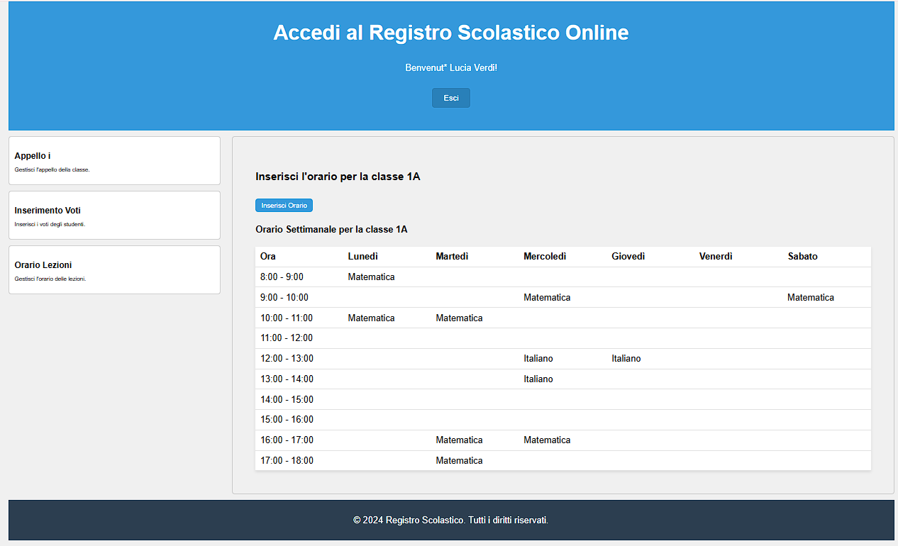

# Chirone V 1.0

Chirone è un'applicazione per la gestione di un registro scolastico online che, in questa versione,  permette di gestire classi, studenti, insegnanti, voti, presenze e orari delle lezioni costruita utilizzando un backend Django e un frontend React Vite.

La creazione di Classi, Scuole, Materie, Insegnanti, Studenti, Materie, Utenti, Gruppi è gestita dall'amministrazione:

- I gruppi servono per dare i permessi agli utenti:
  - Insegnante può leggere e scrivere
  - Studente può solo leggere

mentre le classi Insegnante e Studente sono necessari per collegare gli utenti alle varie classi.

## Prerequisiti

### Backend:
- Python 3.12.8
- Virtualenv

### Frontend:
- Node.js v20.17.0

## Dipendenze Django

- asgiref==3.8.1
- Django==5.1.2
- django-cors-headers==4.6.0
- django-filter==24.3
- djangorestframework==3.15.2
- djangorestframework-simplejwt==5.3.1
- PyJWT==2.10.0
- sqlparse==0.5.1
- tzdata==2024.2

## Dipendenze React

- prop-types: ^15.8.1
- react: ^18.3.1
- react-dom: ^18.3.1

## Struttura del Progetto

### BACKEND
**Models:**
- Gestione di entità come classi, studenti, insegnanti, voti, presenze e orari.

**API REST:**
- Endpoint CRUD per le operazioni sulle entità.

**Autenticazione:**
- Utilizza JWT per autenticare le richieste.

### FRONTEND
**Componenti principali:**
- `App.jsx`: Punto di ingresso principale.
- `Features.jsx`: Funzionalità per gli insegnanti.
- `FeaturesStudenti.jsx`: Funzionalità per gli studenti.

**Autenticazione:**
- Login e gestione dei token (JWT).
- Gestione automatica dei token di accesso e refresh.

## Funzionalità principali

1. **Gestione presenze:**
   - Appello per classe.
   - Visualizzazione delle assenze dello studente.

2. **Gestione voti:**
   - Inserimento voti per gli insegnanti.
   - Visualizzazione dei voti per gli studenti.

3. **Gestione orari:**
   - Inserimento e modifica dell'orario per gli insegnanti.
   - Visualizzazione orario settimanale per studenti.

## Funzioni da implementare 

1. Calcolo delle ore basato sull'orario delle lezioni
2. Inserimento di avvisi nel frontend in caso di azioni non consentite
3. Inserimento di aniazioni per il caricamento dei dati
4. Media dei voti con possibilità di modifica da parte dell'insegnante
5. Possibilità di modificare i voti e i dati dell'appello da parte dell'insegnante
6. Creazione funzione "Agenda" dove l'insegnante potrà segnare note, compiti ecc., e lo studente potrà visualizzarli
7. Creazione funzione "Argomenti trattati" dove l'insegnante potrà scrivere i temi delle lezioni affrontate durante la lezione e gli studenti potranno consultarla
8. Creazione di utenti "Coordinatore di classe" e "segreteria"
9. Creazione funzione "Ricevimenti" dove sarà possibile prendere appuntamento con l'insegnante
10. Implementare possibilità di modificare password

## Guida al popolamento del db

### Gruppi:
- saranno necessari 2 gruppi:
    - Insegnanti
    - Studenti

#
### Permessi
- Permessi gruppo Insegnanti:

 

- Permessi gruppo Studenti:

#
### Users
- dati necessari per la creazione un'utente:

#
### Scuola
- dati necessari per la creazione di una Scuola:

#
### Classe
- dati necessari per la creazione di una classe:

#
### Materia
- dati necessari per la creazione di una classe:

#
### Insegnante
- dati necessari per la creazione di un'Insegnante:
    - dopo aver creato l'utente in user:

#
### Studente
- dati necessari per la creazione di un'Insegnante:
    - dopo aver creato l'utente in user:

# Utilizzo dell'App

### Pagina del log-in
- All'avvio l'app mostrerà il componente intro con il form per il login dove inserire l'username, nel nostro caso sarà formattato come un'email (vedi immagini User), e la password

#
### Features
- dopo il log-in verrà mostrata il componente Features, una nuova sezione che permette l'accesso alle funzioni del registro in base al tipo di utente loggato (Insegnante o Studente)

  - Dopo l'accesso da insegnante:
  
   

  - Dopo l'accesso da Studente:

   

#
### Appello
- Appello farà renderizzare il componente Registro che serve per gestire le presenze degli studenti
   #### Dopo l'accesso da insegnante:
    - cliccando su Voti verrà mostrato il componente ClassSelector con le classi assocuiate all'insegnante che permette di scegliere per quale classe fare l'appello e un pulsante per tornare in dietro
  
    

     - una volta scelta verrà mostrato il componente Registro per fare l'appello per gli studenti della classe selezionata contente la lista degli studenti collegati alla classe desiderata, un pulsante per cambiare lo stato della presenza degli studenti, un campo per l'orario di entrata in ritardo e un per l'orario di uscita anticipata e una ceckbox per le giustificazioni. in basso troviamo altri due pulsanti, uno per l'invio dell'appello e uno per mostrare l'appello della giornata

    

    - dopo aver cliccato su Visualizza Appello dettagliato verrò mostrato il componente VisualizzaRegistro che consente di visualizzare la versione più aggiornata dell'appello del giorno

    

  #### Dopo l'accesso da Studente:
    - dopo aver cliccato su Appello verrà mostrato il componente RegistroStudente che mostra la lista di assenze fatte dallo studente collegato 

   

#
### Voti
- Voti permette di gestire i voti degli studenti
  #### Dopo l'accesso da insegnante:
    - cliccando su Inserimento Voti verrà mostrato il componente ClassSelector con le classi assocuiate all'insegnante che permette di scegliere per quale classe fare l'appello e un pulsante per tornare in dietro
  
    

    - una volta scelta la classe verrà mostrato il componente InserimentoVoti per gestire i voti degli studenti dove saranno mostrati tutti gli studenti della classe, due menù a tendina per l'inserimento dei voti scritti o orali e un campo testuale per eventuali annotazioni sul voto. in basso troviamo altri due pulsanti, uno per l'invio dei voti e uno per mostrare tutti i voti degli studenti

    

    - dopo aver cliccato su Mostra/Nascondi voti verrò mostrato il componente VisualizzaVoti che consente di visualizzare tutti i voti legati agli studenti, i voti sono cliccabili per mostrare tramite pop-up i dettagli del voto selezionato

    

    

  #### Dopo l'accesso da Studente:
    - dopo aver cliccato su Voti verrà mostrato il componente VotiStudente che mostra tutti i voti dello studente collegato

   

#
### Orario
- OrARIO permette di gestire il calendario delle lezioni
  #### Dopo l'accesso da insegnante:
    - cliccando su Orario Lezioni verrà mostrato il componente ClassSelector con le classi assocuiate all'insegnante che permette di scegliere per quale classe fare l'appello e un pulsante per tornare in dietro
  
    

    - una volta scelta la classe verrà mostrato il componente OrarioLezioni dove sarà possibile inserire la materia dell'insegnante all'interno delle ore della settimana in base alle ore assegnategli. in alto (sopra la tabella) troviamo il pulsante per la visualizazione dell'orario complessivo della classe e in basso un pulsante per l'invio delle ore inserite

    

    - dopo aver cliccato su Mostra orario settimanale verrò mostrato il componente VisualizzaOrario che consente di visualizzare l'orario di tutte le materie previste per la settimana

    

  #### Dopo l'accesso da Studente:
    - dopo aver cliccato su Orario verrà mostrato il componente OrarioStudente che mostra l'orario della settimana della classe a cui è associato lo studente loggato

   

  

##
# Crediti

Applicazione sviluppata da Filippo Pieri con l'ausilio di AI

